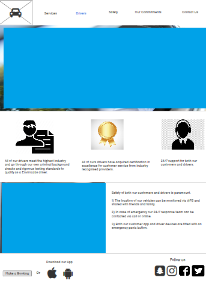
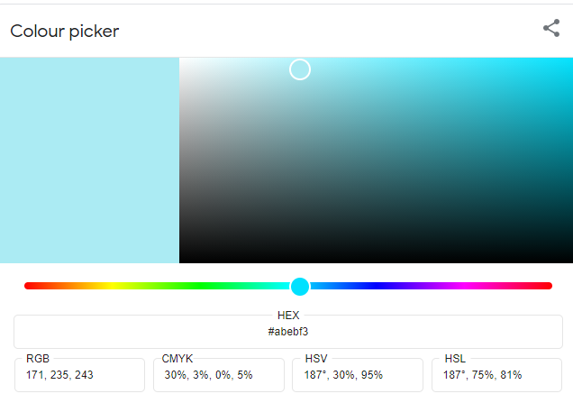
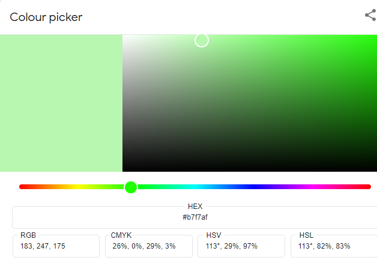

# Milestone Project 1-Envirocabs Website

[View the live project here](https://omerlatif123.github.io/Envirocabs-milestone-project1/)

# Index

1. [What is the purpose?](#What-is-the-purpose?)

2. [UX](#UX) 

 <ul>

 i. [Visitor goals](#Visitor-goals)

ii. [Envirocabs goals](#Envirocabs-goals) 

</ul>

3. [Structure](#Structure) 

4. [Wireframes](#Wireframes) 

5. [Design](#Design)  

<ul>

 i.[Design Features](#Design-Features)  

ii.[Existing Features](#Existing-Features) 

iii.[Differences to Design](#Differences-to-Design)

</ul>

6. [Issues and bugs encountered](#Issues-and-bugs-encountered)

7. [Technologies Used](#Technologies-Used)
   
   <ul>

   i. [Main Languages Used](#Main-Languages-Used)
  
   ii. [Additional Languages Used](#Additional-Languages-Used)

   </ul>

8. [Testing](#Testing)

9. [Deployment](#Deployment)
     
     <ul>
     
     i. [Deploying on GitHub Pages](#Deploying-on-GitHub-Pages)
     
     ii. [Forking the Repository](#Forking-the-Repository)
     
     iii. [Creating a Clone](#Creating-a-Clone)
     
     </ul>

10. [Credits](#Credits)

 <ul>  

 i. [Media](#Media)

 ii. [Code](#Code)

 iii.[Acknowledgements](#Acknowledgements)
   
</ul>

#

### What is the purpose? 

The company wants the website to be simple and visually attractive to its customers. They also want website viewers to be given the opportunity to quickly book a cab or download their app with ease through the website. This is the overall goal of the company to have new and existing customers to book cabs.  Envirocabs has also stated that they want to further expand their social media presence and therefore this must be highlighted on their website, to allow website visitors to access their Instagram, Facebook, Twitter and Snap chat.  

Our client is Envirocabs a start-up minicab office that is environmentally friendly. All Envirocabs vehicles are 100% electric and produce 0% omissions. The client wants to highlight this on their website as an environmentally friendly alternative to its competitors. Furthermore, the company believes there is a niche in the market to attract those aiming to reduce their carbon footprint but still require cabs to travel. The company wants to attract new customers as its innovative and literally a breath of fresh air from its polluting competitors. Envirocabs wants us to also highlight the environmental initiatives to further bolster their public image. 

## UXD 

 Visitor goals     
1)	I want to be able to navigate through the website quick and easily. 
2)	I want the process to book a cab to be simple as possible.  
3)	I want to learn about the company and its ethos on their website.  
4)	I want to be able to follow the company on various media platforms.  
5)	I want to learn about the safety procedures the company has in place during the pandemic.  

### Envirocabs goals 

1)	We want visitors to the site, to book on our website directly or download our app to book a cab. 
2)	We want visitors to be aware our fleet of vehicles are 100% electric and there 0% emissions, want to target customers who want to reduce their carbon footprint and those wanting to be greener.  
3)	We want visitors to be presented with information that we are a green alternative to other companies. 
4)	We want visitors to be aware of our social media presence, follow us on various media platform to expand our brand.  
5)	We want visitors to be aware our community initiatives, this will be good PR for the company.  

## Structure 

1)	I want to be able to navigate through the website quick and easily.   
    
    The website will have a navigation menu at the top of the webpage, that will allow a visitor to select a heading to direct them to a new page. The header will have a logo when pressed that will take the visitor (which is a modern feature of other websites) to the Home Page. The rest of the header will have the following new page links Services, Drivers, Safety, Our Commitments and Contact Us.    

2)	I want the process to book a cab to be simple as possible.      

    The Website Homepage will have a button on the hero image that when selected will take the visitor to the contact us page. The visitor can book directly through the webpage by filling out their details in the form and submitting it. 

3)	 I want to learn about the company and its ethos on their website.  
     
     The Home page will have a section which gives a visitor information about the company with the use of icon and text. Too much information will not be provided as to prevent the users from being overwhelmed with information on the Home page. The home page will feature testimonials from previous customers to reassure any new customer about its service. For further information about the company’s ethos the visitor can click on our commitments heading. The page will highlight the company’s commitment to the environment and its plant a tree initiative. It will state what the company has implemented to make itself environmentally friendly.    

4)	I want to be able to follow the company on various media platforms.  
    
    On every page the website footer will have follow us text with icons for Facebook, Snapchat, Twitter and Instagram. The visitor to the webpage must click on the icons to be taken to their websites.         

5)	I want to learn about the safety procedures the company has in place during the pandemic.  
     
     Considering the on-going pandemic, customers want to be reassured that practices are in places to keep them protected. The Safety page will highlight with icon and information that the vehicles are regularly cleaned, drivers will wear a face mask along with customers, hand sanitiser is available to use, and safety screens are in every vehicle.  The company’s commitment to customer safety will be highlighted by promoting they have acquired an accreditation in hygiene.

6)	We want visitors to the site, to book on our website directly or download our app to book a cab.  

    The Website Homepage will have a button on the hero image that when selected will take the visitor to the contact us page. Furthermore, on every page the website footer has the option to book directly through the website with a make a booking button or to select the apple or android icons that will allow the customer to download our app.   

7)	We want visitors to be aware our fleet of vehicles are 100% electric and there 0% emissions, want to target customers who want to reduce their carbon footprint and those wanting to be greener. 
    
    On the Homepage the visitor to the site will be given some information about Envirocabs. The visitor will be provided with information that the vehicles are electric and produce no emissions. Other headers such as Service will provide type of cabs we offer (standard 5-seater car, executive car, and 7-seater car), and other services such as removals (van) we offer but emphasising our fleet of vehicles are 100% electric and produce 0% emissions. 

8)	We want visitors to be presented with information that we are a green alternative to other companies.     
    
    This is highlighted throughout the website; on the Home page it states Envirocab vehicles are electric, and some testimonials highlight that Envirocabs is a green alternative. The other page headings such as Services will highlight all the vehicles are all 100% electric. The Our Commitments page is dedicated to the company’s green initiatives.    

9)	We want visitors to be aware of our social media presence, follow us on various media platform to expand our brand.  

     On every page the website footer will have follow us text with icons for Facebook, Snapchat, Twitter and Instagram. The visitor to the webpage will have to click on the icons to be taken to their websites.         

10)	 We want visitors to be aware our community initiatives, this will be good PR for the company.  

     For further information about the company’s initiatives the visitor can click on our commitments heading. The page will highlight the company’s commitment to the environment through its plant a tree initiative. It will highlight Envirocabs commitment to work with and support local communities through environmental schemes. Furthermore, local communities will be educated on sustainable living and becoming greener.  

      
## Skeleton

Wireframe mockups were created in a Balsamic with our clients and potential visitors goal in mind.
Images section in the wireframes have been higlighted in blue, this was previously due to the images from the wireframe being different from the completed website. 
Furthermore the images used on the final Envirocabs website are free to use images causing no copyright/royalty payment concerns. Some of the images from the wireframes may not have been copyright/royalty free and therefore the imagess have bee covered as a precaution. 

Home Page:

Services Page:

Drivers Page:

 Safety Page:

Our Commitment Page:

Contact Us Page:

# Design

### Colour Scheme
The two main colours used are Blue and White as these colours compliment the Envirocabs logo. The colour concept is blue because this is associated with the colour of electricity this relates to our vehicles being 100% electric. White was used as a contrast to blue and gives the website a simplistic but professional and sytlish look. The website should look appealing but should allow the customer to focus on the content rather than to visually distracted by an array of colours.
Green was picked for the Our Commitment page in which we the client wanted to highlight their green initiatives and procedures Envirocabs is implementing to go greener. Environment is associated with green and therefore we wanted this to be highlight. All other webpages have blue text, but Our Commitment page has green text. The sudden colour change will draw the attention of the user when they are on this page.   

 #### Colours used in website background and text.

-  **White** (#fff),
-  **Blue** (#007bff),
-  **Green** (#04AA6D),

 #### Colours used in grids, containers and other sections. 

#### Typography
The headers on all pages throughout the Website and main text is using the font ‘Roboto’ with default text of ‘San-Serif’. The header text and parts of the main text are bold catching the user’s eye. We have kept our content at a minimal not to make our website cluttered or causing the user cognitive overload with large amount of information text. Furthermore when researching other cab webpages such as uber,bolt etc have minimalistic content.

#### Imagery
Brand awareness is important to Envirocabs and they have requested their own Logo to be used in the Nav section of the website. The header contains the Envirocabs logo which has been designed and created on www.wix.com. (https://www.wix.com/logo/maker/esh). The logo is interactive and when clicked will redirect the user back to the home page.   
The images used are all related to section of the website the user is on, for example in the safety section the hero image is of a car interior being cleaned. The imagery chosen fits well within the theme of the webpage as they relate to the subject matter. The imagery used is also visually striking without being overbearing on the rest of the webpage.     

# Features 

## Design Features

### <strong>Header</strong>

Contains Envirocabs logo in the top left of screen and when clicked will redirect user back to home page. The right of the navigation bar contains headings (our Services, Drivers, Safety, Our Commitment and Contact us when clicked will direct user to appropriate page of website. 
On smaller screens, the navigation bar collapses into a toggler icon. Clicking it will reveal navigation headings.  

### <strong>Footer</strong>

Left hand side of the footer contains make a booking button when clicked will redirect user to contact us page which has the make a booking form. The user can make a booking directly through the Envirocabs website or is given the option to download the app. Both the Apple icon and Android icon when clicked will redirect users to their platforms for them to download the app. The right-hand side of the footer contains social media icons, when clicked will redirected to the company’s social media pages.  

### <strong>Home Page</strong>

Hero image with Booking button- Below the header there will be a large hero image with a bold blue/ white booking button. The booking button on the hero image when clicked will redirect the user to the contact us page which has the make a booking form. The high-quality professional image used sets the tone for Envirocabs webpage. 
Information container with icons- The information container provides brief information about the positives of using Envirocabs to the user/customer. Information is concise and straight to the point therefore keeping the user engaged. Too information may prevent the user from reading further, icons above the information to makes it visually appealing.   
Testimonial- The testimonial section provides quotes and images of happy customers. This was designed to persuade users/customers to use Envirocabs. When reading positive comments about the company it will reassure users/ first time customers who are thinking of using Envirocabs. The testimonial background colour was used to draw the user’s attention to the section and break up the colour scheme of the webpage. 

### <strong>Our Services section</strong>

Hero image- The large hero image below the navbar will be relevant to the section.
Information container- provides the relevant information to the customer about Envirocabs electric vehicles and visually separates the page. The section has been left with colour to the text or background to prevent visual overload. The hero image is visually striking and the services grid therefore in the middle of the webpage is left plain. 
Information grid with images- grid of 8 boxes but split into sections of 2. The boxes on the left side contain information about the vehicles and the boxes on the right side have the images of vehicles. This provides clarity to the user/customer to view and read about the vehicle that suits their need before they book. Two tons of blue are used to alternate between the boxes to create a visually appealing section.    

### <strong>Drivers section</strong>  

Hero image- The large hero image below the navbar will be relevant to the section.
Information container with icons- The information container provides brief information about the Envirocabs drivers, for customers own peace of mind information such as drivers being certified and have had criminal background checks provide reassurance to user/customer that they are in the safe hands of a professional company. Information is concise and straight to the point therefore keeping the user engaged. Too information may prevent the user from reading further, icons above the information to makes it visually appealing.     
Information container with picture - provides the relevant information to the customer about customer safety, the section has been split. The left side has a visually striking image, and the right side has information. The section provides information about safety of passenger, the customers journey can be tracked via GPS. The Envirocabs app has an emergency panic button or customers/drivers can call a 24/7 support team. Dark blue has been used for the text and lighter tone of blue has been used for the container’s background. Both colours complement each other will without either being overbearing visually. 

### <strong>Safety section</strong>  

Hero image- The large hero image below the navbar will be relevant to the section.
Information container with icons- The information container provides brief information about the procedures Envirocabs has implemented to keep customers during covid-19 pandemic. This section provides Information into the safety policies implemented such as requiring both customers and drivers to wear masks. Brief information is provided about the companies cleaning procedure and hand sanitiser readily available to customers. The information is concise and straight to the point therefore keeping the user engaged. This section provides reassurance to customers that Envirocabs is doing its upmost to be covid safe. Too information may prevent the user from reading further, icons above the information to makes it visually appealing.        
Information container with picture - provides the relevant information to the customer about customer safety, the section has been split. The right side has a visually striking image, and the left side has information. Information that Envirocabs has been accredited in safety and hygiene certificate 2021 for cleanliness of vehicles. 

### <strong>Our Commitments section</strong> 

Hero image- The large hero image below the navbar will be relevant to the section.
Quote container- has a large commitment message from Envirocabs.
Information container with picture - provides the relevant information to the customer about the environmental initiatives and commitments Envirocabs has implemented. The sections alternate with information and images. One section of information provides details on Envirocabs plant a tree campaign and the other section of information provide details of procedures Envirocabs has introduced to become greener. Green has been used for the text colour to reinforce the concept of environmentally friendly.

### <strong>Contact us section</strong>

Hero image- The large hero image below the navbar will be relevant to the section. 

Booking form- below the hero image the page is split into two. On the left side is contact details of the companies registered address, email, and telephone number. On the right side of the page a simple form to book a cab, asks user/customer to provide their full name, contact number, email, pickup/drop off address, date, and time. All relevant information must be provided before larger book button can be clicked.

#
## Existing Features

- Envirocabs logo- Contains Envirocabs logo in the top left of screen and when clicked will redirect user back to home page, located on all pages. 

- Navigation bar- The navigation bar contains headings (our Services, Drivers, Safety, Our Commitment and Contact us) when clicked will direct user to appropriate page of website. On smaller screens, the navigation bar collapses into a toggler icon. Clicking it will reveal navigation headings.  
 
- Make a booking Button-When clicked will redirect the user to the contact us page, which contains the booking form. There is only one make a booking button on the home page hero image, the other sections hero images do not have a button. 

- Footer-contains make a booking button when clicked will direct the user to contact us page, which contains the booking form. The footer also contains download our app text with Apple and android icons. When clicked either one this will take you to the Apple or Samsung webpages. The footer contains social links to Twitter, Snapchat, Instagram, and Facebook.  

- Contact Form - This can be completed on the contact us page and used to book a cab. Brief information is required from the user/customer to complete the form. If any information is missing the form will specify. 

#
## Differences to Design

In the original design, the booking button and download our app link was in the footer even when reduced to mobile device size. Current design the section is hidden when reduced to a smaller size this something that should be rectified in the future. The reason why this section is hidden when website is reduced in size is because the footer looks cluttered and visually unappealing. 

Features left to implement in the future

Have google maps embed in the contact us page showing the location of Envirocabs head office. Currently having issues embedding maps on smaller devices therefore omitted it from web page. Will attempt to resolve when there is less of a time constraint. 

Email confirmation and text confirmation of when booking form is completed by user/customer. Currently unable to as webpage is static and Javascript has not been applied.   

Have an interactive chatbot on the website that can answer certain queries such as providing user/customers with price quotes of journeys. This is currently difficult and will require further research and expenditure to implement.    

# Issues and bugs encountered
As a developed I encountered various problems throughout which I have resolved or learned to work around. 

<strong>Gitpod</strong>- One of the biggest issues I encountered was my own lack of understanding of my developer tools. While working on my project previously on Gitpod I would only git commit my messages assuming everything was being saved, how wrong I was. Its during my second mentor meeting that my mentor examined my code and commits to realise no messages had been saved. I was incorrectly only git committing messages, but I had not used git add before, so the message was never registered correctly. 
During my second mentor meeting because of my failure to register messages correctly, Gitpod had 79 unsaved changes after a failed attempt to save the page, I was advised to restart my project. I opened another Github repository and have been git adding, committing, and pushing my work correctly. This was an issue for me as I had to restart my project and had wasted time, but it is something I have resolved with the help of my mentor and viewing and understanding the code institution videos clearer. 
This has helped me develop good practises as a developer for future projects so every time I use Gitpod I always add and commit messages correctly and I git push, so I have a copy of my code on GitHub, had to reschedule a mentor meeting because no work had been pushed onto Github and Gtpod had stopped responding on the day of the meeting. Overcoming this challenge has made me more comfortable as a developer.

<strong>Navbar menu toggler</strong>- When implementing a navbar menu toggle for when the page is viewed smaller devices the navbar I had already created would not allow me to implement the toggle. When adding the code for menu toggler to my existing code my headers on my navbar for larger screens would shift position and any padding applied would be lost. After researching these issues and asking fellow developers on slack that I discovered the solution. I had to completely restructure my navbar code and start over. The Navbar I have created now is a lot more responsive although slightly different my appearance to the previous navbar, changes to a hamburger toggle when web page size is reduced. 

<strong>Webpage responsiveness</strong>- When creating my webpage originally, I did not implement mobile first design approach, the Envirocabs webpage looked visually appealing on bigger screens but when reduced in size and when page responsiveness was tested on other devices the page layout would shift, creating inconsistencies in the design. Both images and text would go out of position or merge within each other. To address this issue further research was done into website breakpoints and responsive design. I was advised by my mentor during our meeting to grasp a better understanding of this area. Websites such as W3schools.com and others helped rectify the issue as it helped to create a better understanding of device responsiveness. For smaller devices, the standard breakpoint of small was not sufficient and therefore XS was applied. 

<strong>Envirocab Logo</strong>- A bug was detected in the navigation bar, the Envirocab logo when clicked should have redirected the user back to the home page.  When applying code to the other headings on the navbar they became responsive. The other navbar headers were responsive and when clicked would redirect the user but the Envirocabs logo when clicked was not. 
Both Slack and researching to resolve this issue took considerable amount of time but did not resolve the problem. Instead, I began using dev tools to look at existing websites and what techniques they had used to make their logos responsive when clicked. The AA website when viewing inspecting its code in dev tools, I realised how they had made their AA logo responsive when clicked redirected user back to the home page. I applied the same method do my open code without also copying theirs and it worked. 

<strong>Fixed Header</strong>- Created a fixed header as discussed with my mentor, had issues with creating it as the navbar would disappear when amending its CSS position to fixed. Resolved issue when using dev tools, the hero images and other images position was set at relative, in dev tools I removed this position from the images and the footer became fixed. Now header is fixed in all pages and when scrolling down the page remains in place.  

<strong>Hero images</strong>- issue with quality of free images online, replaced images with higher quality ones as on other devices images looked grainy and blurred.   
 

<strong>Overflow issues</strong>- when using website on any devices there was a gap being created so advise from students on slack to use unicorn revealer to work out where overflow is on the page, then I used dev tools to work out what was causing problem released some container margin-right and left were set at 15px when I corrected this to 0px for both, this resolved the issue and the overflow disappeared. 

# Technologies Used

#### Main Languages Used

•	HTML5

•	CSS3

#### Additional Languages Used

•	JavaScript - Used to implement a function that allowed the Navbar to change to toggle drop down menu when user views webpage in mobile device, for UX purposes.
Frameworks, Libraries & Programs Used

•	[Bootstrap](https://getbootstrap.com/docs/4.4/getting-started/introduction/) -Bootstrap was used to implement the responsiveness of the site and style to the website. Boostrap provided grids and containers for the site.

•	[W3schools](W3schools.com) -Like Boostrap W3schools was used implement responsiveness and design to the site. Furthermore, provided valuable information when I was stuck or unsure about certain parts of the website.   

•	[Pexels](Pexels.com) -Pexels was used to provide the high-quality free images in the webpage either the hero image or image sections part of the website.  

•	[Unsplash](Unsplash.com) -was used to provide the high-quality free images in the webpage either the hero image or image sections part of the website.  

•	[Freepik](Freepik.com) -Out of all the free images sights, freepik’s provided me with the best quality images which has been used for all the hero images across the site. 

•	[Pixabay](Pixabay.com)  -Free image site that has been used for image section of the website.  

•	[Google fonts](fonts.google.com) - Google fonts was used to import the fonts "Roboto" and Sans Serif" into the style.css file. These fonts were used throughout the project.

•	[Fontawesome](fontawesome.com) -was used on all pages throughout the website to import icons (e.g. social media icons) for UX purposes.

•	Gitpod - was used as the platform to write our code and display the look of our website.
    The GitPod terminal was used to write our code add a message to commit to Git and push to GitHub.

•	GitHub -GitHub was used to store the project after pushing

•	Balsamic -Balsamic was used to create the wireframes during the design phase.

•   [Am I Responsive](ami.responsivedesign.is) - Am I Responsive was used to generate mockup imagery to be used.

# Deployment
 
I created the repository using the following steps:

1.	Logging in to my GitHub account and opening the relevant repository.
2.	Click on the settings button, located just above the green GITPOD button.
3.	Scroll down the Settings page to the "GitHub Pages" section.
4.	Under "Source" click the drop-down menu labelled "None" and select "Master Branch".
5.	Upon selection, the page will automatically refresh meaning that the website is now deployed.
6.	Scroll back down to the "GitHub Pages" section to retrieve the deployed link.

Forking the GitHub Repository

Forking a repository enables us to make a copy of the original repository on our GitHub account so we can view it and make changes without affecting the original work. This is done using the following steps:
1.	Log in to GitHub account and select the relevant repository.
2.	To the top right of the page there are three the buttons, the furthest right says Fork. Click on this button.
3.	A copy of the original repository will now be in your account.

Making a Clone

To make a clone of my project use the following steps:

1.	Go to my account and locate relevant repository.
2.	Next to the green Gitpod button, click on CODE.
3.	Click on Download Zip.
4.	Once dowloaded, you can extract the zip file's contents and save to a desktop and run the website locally.

# Credits

### Media

•	All images were sourced from the various free image websites.  
               
               Pexels.com  
               Unsplash.com
               Freepik.com    
               Pixabay.com  

### Code

I consulted multiple sites to better understand code that I was trying to implement. For code that was copied and edited, I made sure to reference this within the code. The following websites were used the most often.

•	W3Schools

•	Bootstrap

### Acknowledgements

•	Code Institute for giving me the know how to create my own website.

•	The Slack community/ Mini Feb 20201 team on slack for all the feedback and help given to me. Without the Slack community I may not have known about tools like unicorn revealer, which was mentioned by a team member. This helped solve my issue plus gave me a useful tool for the future. 

•	My mentor Seun for helping to guide me through my first project.

•	Friends and Family who have given feedback during the testing phase of my project.

